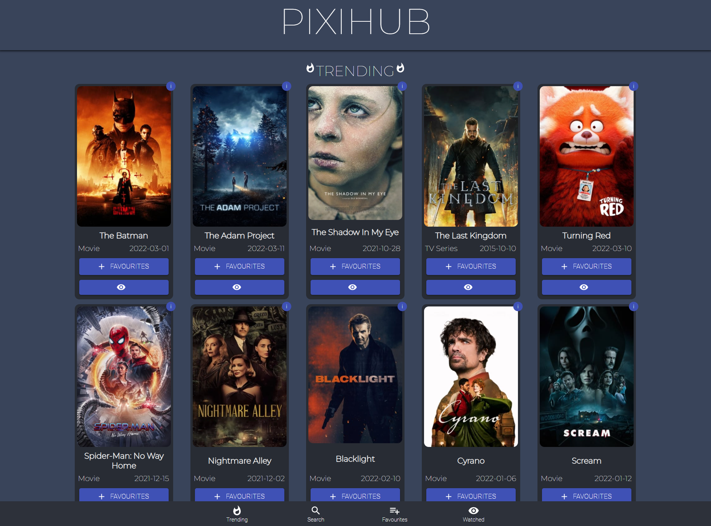
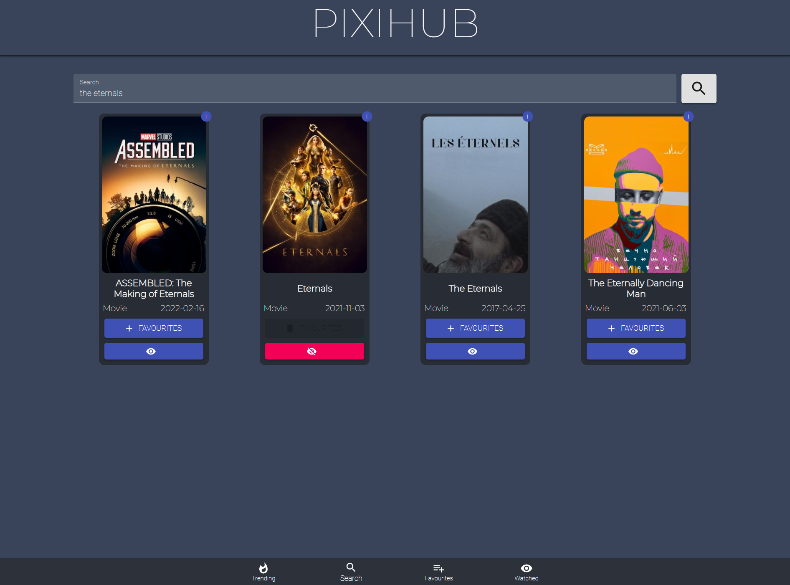
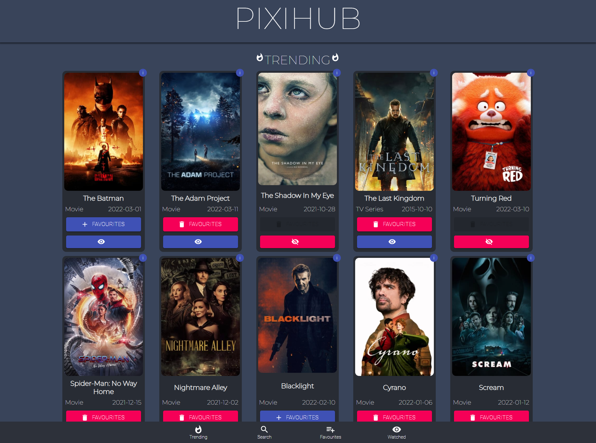
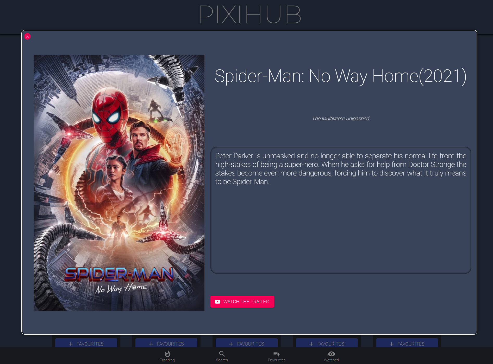
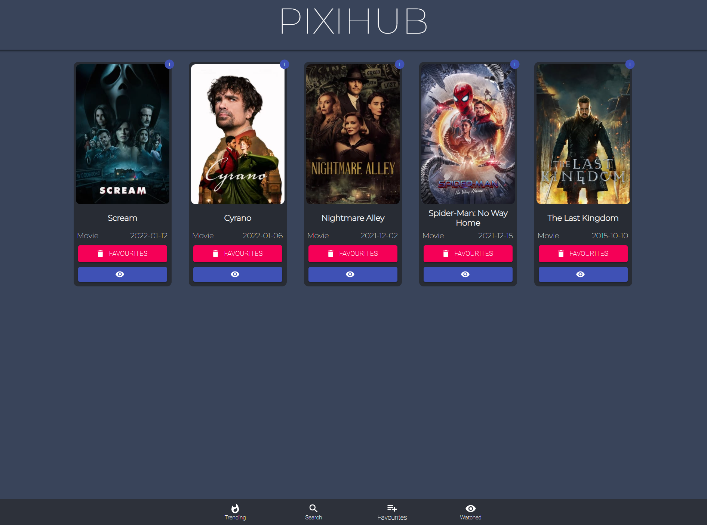
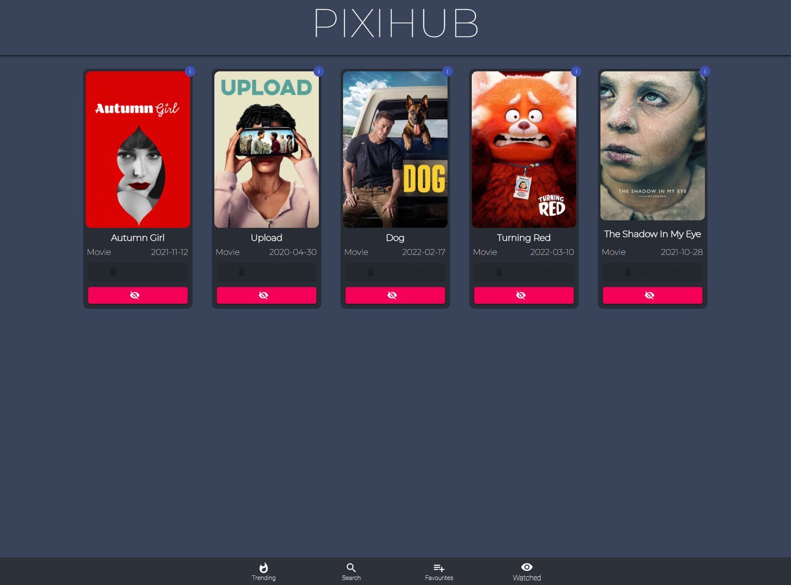

# PixiHub

PixiHub is a Movie app that can be used as a personal Movie List tracker for the all the user's favourite films and tv series. 

It mimics the UI of exisiting popular entertainment apps such as Netflix, Disney+, etc. to allow the user to have an overview of different movie titles at a glance. 

Upon entering the app, the user is immediately greeted by the Trending page, which displays the top newest movies that recently premiered.

Users are also able to search for specific movies, using the search function at the app's search page. It displays the top relevant matches. 

Its interactive movie card enables the user to add movies to Favourites as a reminder to watch later, or add it to Watched if seen before. Clicking on the "i" at the corner of the card, blows it up into a modal window. It displays the movie's summary and a dedicated button to the watch its trailer via YouTube link. To return to the original page, simply click on the "X" at the corner of the window or anywhere outside it to close it.

The Favourites and Watched pages keeps track of the user's media content journey. It can be used as a watchlist "binge reminder" ahead of a busy schedule, and a way to show off your movie count or how much of a Star Wars geek you are to your friends. 
Once movies are saved in one of these pages, it will be marked accordingly when you come across it again at any page. Never fret over bookmarking the same movies again!    

## Technologies used
React.js  
Javascript  
Material UI v4  
CSS  
HTML  
YouTube  

## References
https://www.youtube.com/watch?v=vxUfx4aM5d8&t=1583s  
https://www.youtube.com/watch?v=1eO_hNYzaSc&t=3359s

